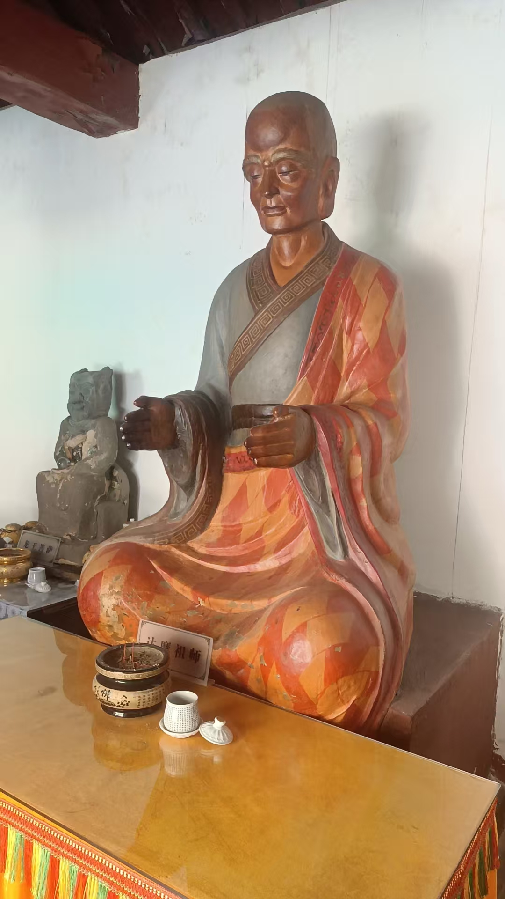
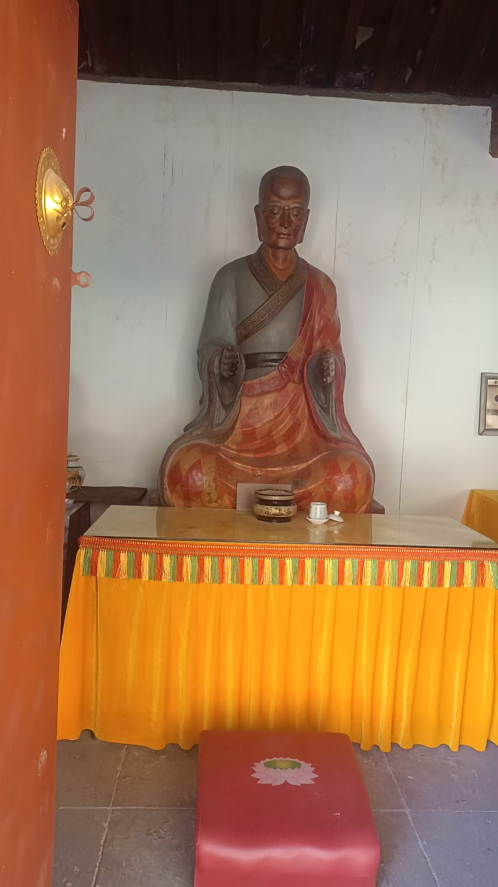



拉手一段时间后，推纸片

就是把一张A4纸，稍微弯一弯，能立在桌子上

两只手，一边一只，去推

不一定推动，但时间长了，手上力度，就会感觉越来越

再去练推风车，把纸片放在针尖上，牙签上，

去推纸片

其中微妙感觉

练了才知

很有意

主要有个好处，练的力度大了，自己或者家人，有个头疼脑热的，手一扫就好了

人的疾病，都是正能量缺失，负能量入侵

咱们也看到了，手上能量，放着光，一扫，光就修复