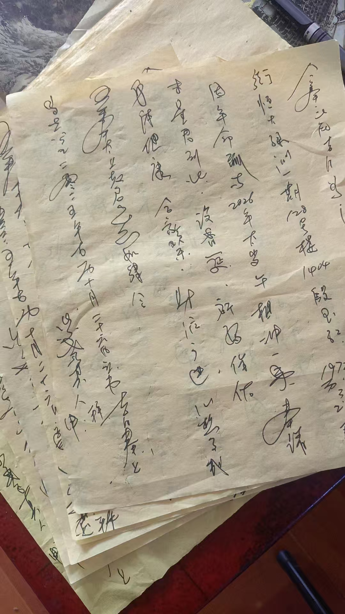化解太岁
文书
八字化解
加民俗化

下一步，买点厚黄裱纸，把化太岁文书打印出来，
这样写，累的手抖

今年三个档次，一百，二百，三
二百就单独做不了

要有供品，酒，请太岁跟和神，一桌，就是一般酒，也得几百了

钱粮，每人一个一个就是几十块

大庙里是二百，就一个自己做的大锦盒，填上名

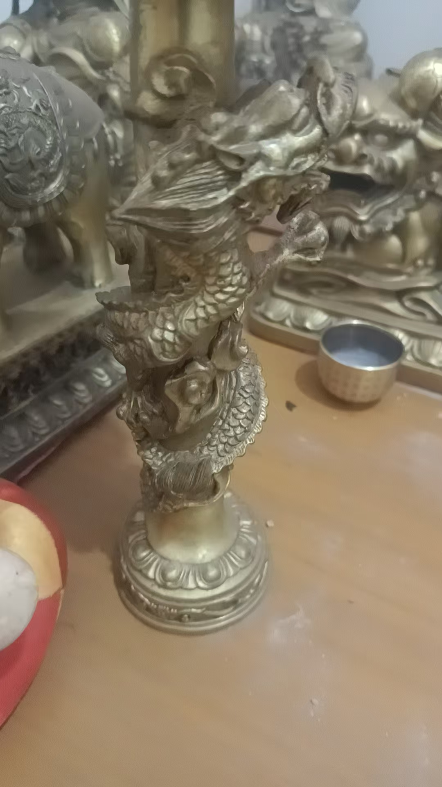
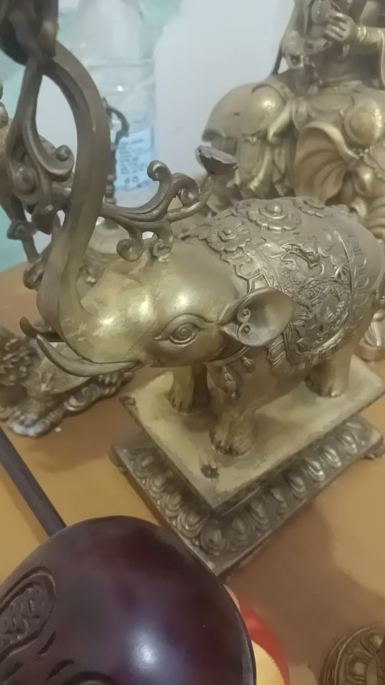
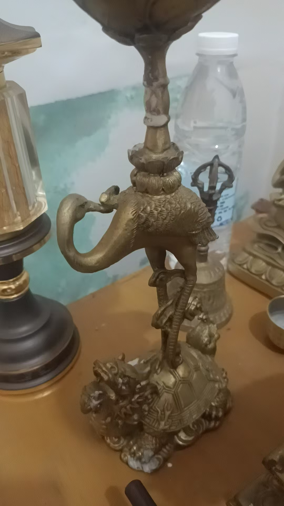
盘龙，大象，龟鹤

这三对灯

分别代表，文章，财，

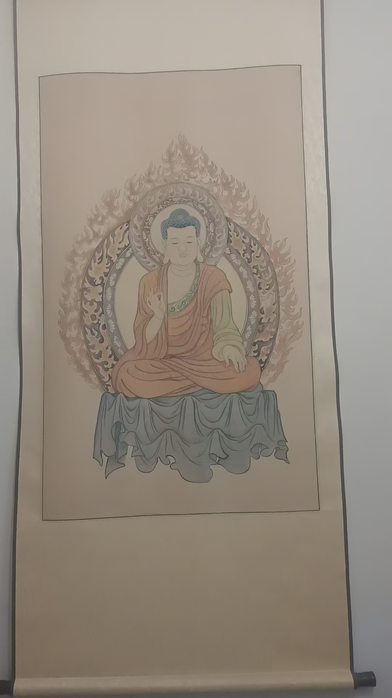

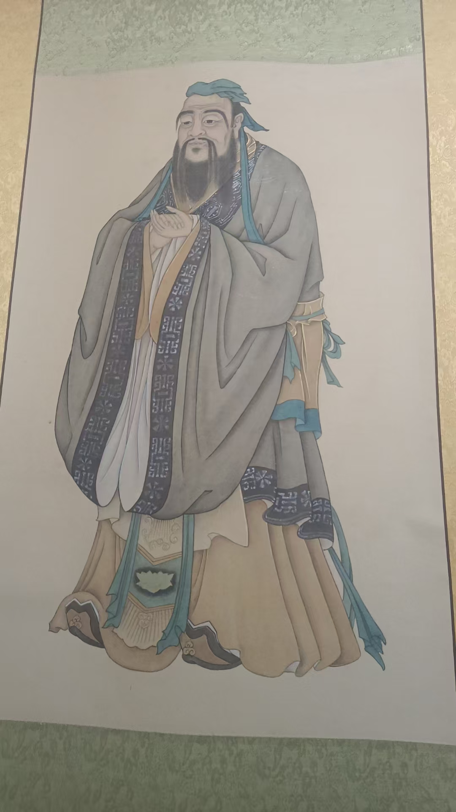

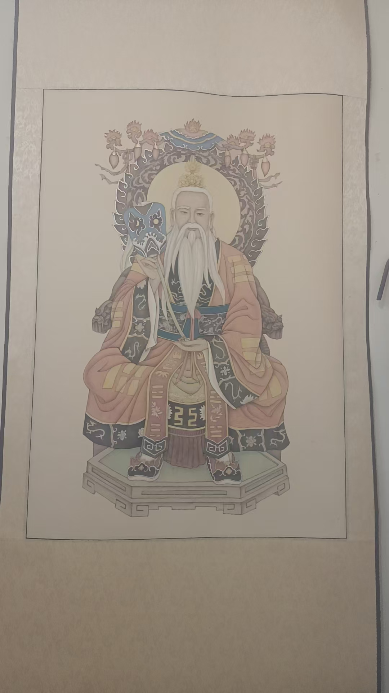

科委那时候讲究广才儒释道

也就是兼修儒释道

又不单独属于儒释

所以，我说是出自科

源自民间

老师，都哪些属相必须化太

每年不一

明年丙午，马

子午冲，属鼠的冲太岁

丑午相害，属牛的

卯午相破，属兔的

午午自刑，马坐太

2026年就是这四个

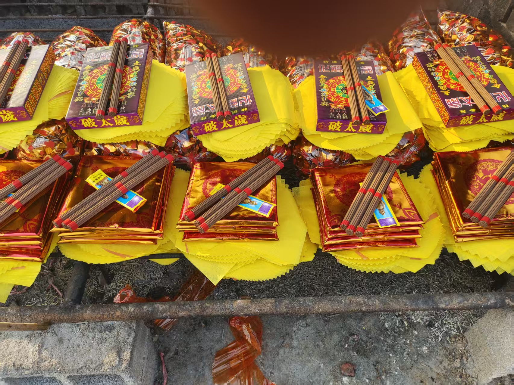

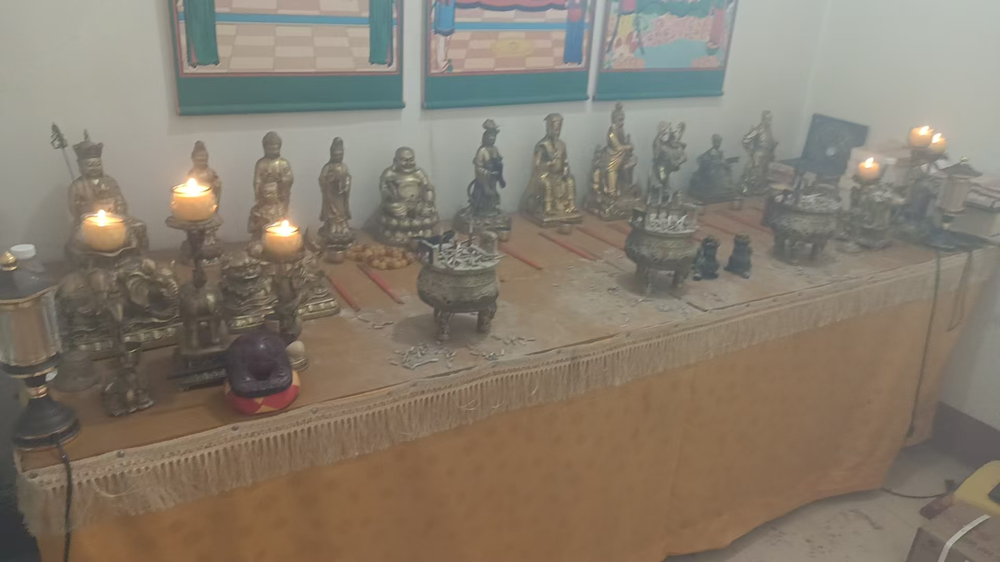

加供

一会去买水果，中午供奉

神也信，佛也信，就是民俗

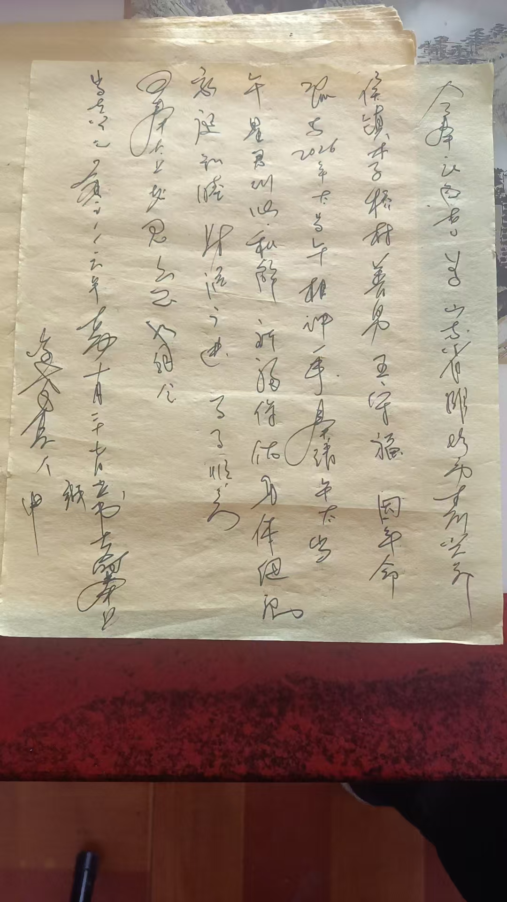

有空再说文书的写

主要是咱们化解太岁，把念力加进去了，真起到调和一年气场作

这是主要

6年之前都可以化解吧？

尽量早化

是因为有的大运不好的，再犯太

就会出现干透三

就是2026年的太岁负场，会提前三个月到

在古历，十一月子月，就已经是明年

八字化解太岁，就用未星君，来合住午太

就不会有刑冲克害

就是说，还有化太岁，一家一般不只有一个，拿不出上千块银子

就在自己菩萨面前，没有菩萨像的，就在厨房灶台上，灶王神君面前，没有灶王像也可

买三样水果，三支香，三杯酒，三杯

初一或者十

供一

念，
026午太岁，跟未星君来和解（住址名字生日）因犯太岁一事，设香筵，祈福保佑，身体健康，阖家幸福，财源广进，诸事遂心，吾奉太上老君急急如律令

批发商烧元宝，方便多

以前，买完供品，摆香案，再去拉回元宝来烧，写文书，一天累够呛

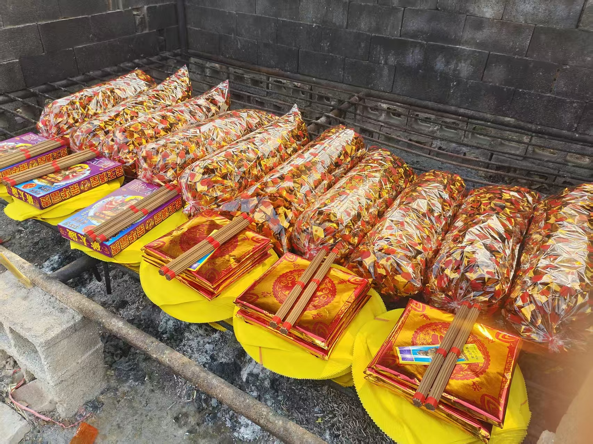

