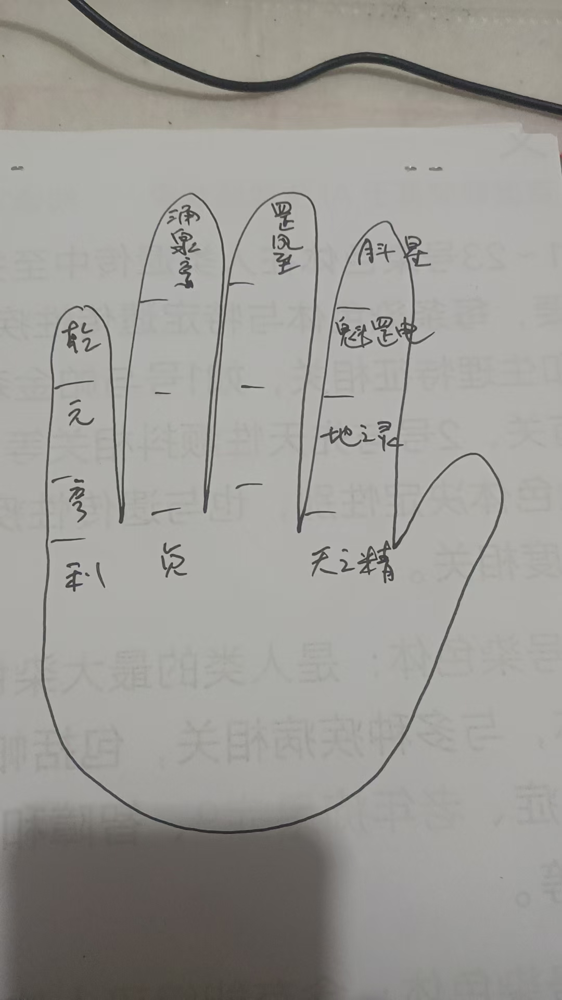
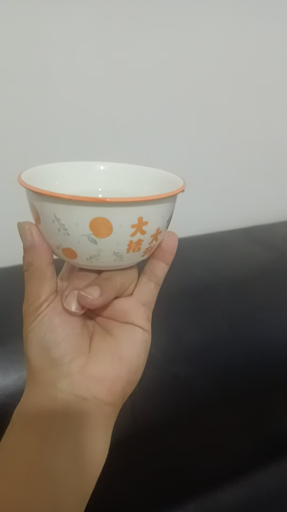
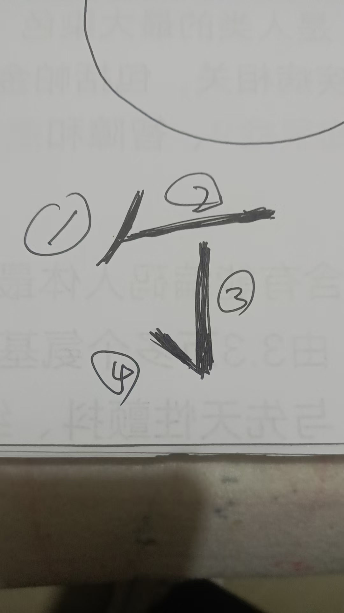


# 【玄门修真录】剑指修持与心法演练 紫鸢真人传授

## 第一章：剑指开光与修持（外练）

**【修法总纲
*
此法为《乾元亨利贞》之基础应用。欲使剑指具备能量，需每日修持，将自身能量注入指尖。修成后，剑指发热、麻胀，书符、指物皆有灵效

**【修持时间
*
每日**辰时**（早
7:00 
9:00）
需连续修持**七天**，每天念诵并演练**四十九遍**

**【修持仪轨
*
1.  **站桩**：面向太阳，身心放松
2.  **掐诀**：大拇指开始掐诀（按传承手势）
3.  **咒语**：口念修持咒（输入能量）
    > **天之精，地之灵
*
    > **魁罡电，月斗星
*
    > **罡风至，涌泉亨
*
    > **乾元亨利贞！**
4.  **发劲**
    *   念毕，右手结**剑指**
    *   向外猛力甩出（指向目标或虚空）
    *   同时大喝一声：**“开！
*
    *   *（观想：从剑指尖端射出一道能量气，如电流或白光。）*

**【感应验证
*
剑指打开后，指尖会有发热或酥麻之感，此乃气通之象，因人而异

---

## 第二章：三山印与符水法（应用

**【三山印托水
*
左手
*三山
*（大指、食指、小指竖起，中指无名指弯曲），托起一碗清水

**【虚空讳字法
*
右手
*剑指**，向碗中水面虚空书写讳字
此字
*四笔**，每写一笔，念一句口诀

**【书符口诀
*
> **一飘金牛头
*
> **横断日月流，**
> **倒下千斤坠，**
> **一挑鬼神愁
*

**【要旨
*
剑指修练好，手指发热，以此能量写入水中，方能制成法水

---

## 第三章：法器运用与禁

**【宝剑与剑指
*
*   **剑指**：乃随身法器，能量充足时，可隔空化解千里之外之事
*   **宝剑**：若持有实体宝剑，无需书符，直接以意念命令业障离开。观想灰气变白亮，病患即愈

**【重要禁忌：先礼后兵
*
凡使用宝剑或强力剑指法前，必须“先打招呼
*
*   **原因**：有些病人体内或家中有“顶仙”或保家仙。若不提前说明直接动法，宝剑煞气会伤及附体仙家或家神
*   **方法**：使用前，口头说明或用念力发出信息：“一切神煞皆要回避，吾今治病（或办事），免伤无辜。

---

## 第四章：静坐与法身演练（内炼心法

**【进阶心法
*
进不了心法修炼，便得不到真法器。战魔用的是心，不仅手中有剑，心中更要有剑

**【静坐演法步骤
*
1.  **静坐**：心神宁静，进入定境
2.  **观想**：在定境中“看”到自己（此
*法身**，而非肉身）
3.  **演练**
    *   观想一个个法身在练剑
    *   法身可分身无数，成千上万
    *   手中的剑（法器）亦随之分化无数
    *   唯有法身，方能挥动真宝剑

**【心剑合一
*
*   **境界**：剑指挥动时，不仅是手指在动，要有光气拖尾
*   **核心**：从有形之剑练至无形之剑，心念一动，法身即动，万剑齐发

---

> **编者注**：此法由浅入深，先练气（开剑指），再练术（符水），终练神（法身观想）。切勿好高骛远，需循序渐进。泄露天机，只传有缘，望习者珍之