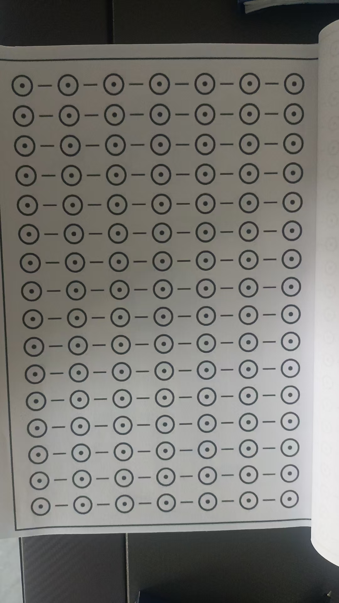

前几天，有个朋友说，七田真的秘诀就在平行

练成了，看一页书，立体高清，小化呈现在眼前，不就一眼看全一页纸了吗

太奇妙了，越远画面越

飘在原来页面上面，还会活

人外有人，天外有

把这个活动的页面打到墙上

怪不得觉得杨龙讲的跟吕祖有关，正在直播，正好说到吕祖修炼

原来如此

这幅图，用三D眼看

图上飘出一张立体小图来

一眼就能看全图

也可以脑屏里先完成，还可以白墙壁投屏

一目十行的基础
