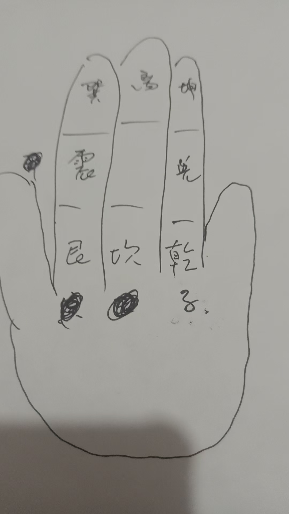


咒，青龙居我左，拇指点食指中

白虎是侍我右拇指点无名指中间

朱雀护我前拇指点中指顶节

玄武立我后拇指点中指底节

四方四神将拇指点中指中节

将我元神护拇指点无名指指

吾奉太上老君急急如律令

边念咒边点念到急急如律令后，四指迅速握住大拇指即可，此法随时可以用作护

念咒的同时观想四神兽

左右手都可以

夜行害怕念
，阿弥陀佛大如天，八大金刚站两边，前后都有金刚护，哪有恶鬼敢傍边，吾奉太上老君急急如律令

