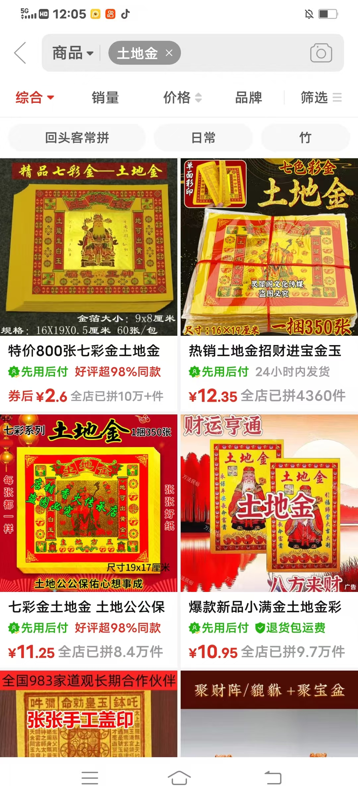
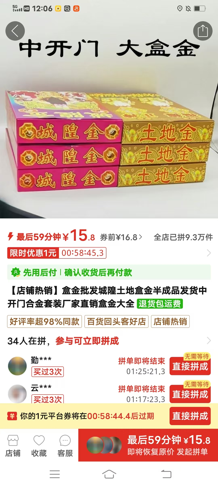

就像咱们的宅子，建好之后，有形了，就会有门神，窗户神，厨房神，灶神，厕所神，水龙神，太岁，土地公，宅神，四大金刚，土王，三煞神，八卦九宫十干神，十二支神等等

师父昨天帮我化解了土地神，昨晚孩子们过来上课说怎么今天脚底那么热呢

祭拜宅子土地公的同时，买六只小铜猪，开光后，头朝西北摆放在地上墙角 （针对个案的方案

土地金一

腿脚凉，你家土地不亮

你网上买两个土地

土地金一个是自家，一个是单位

土地金是什么？

土地金，供奉土地专用礼盒

一般每年都要烧

地太岁，土地

刚才我敬当坊土地，各路神

所到之处，必先提前拜当地土地山

