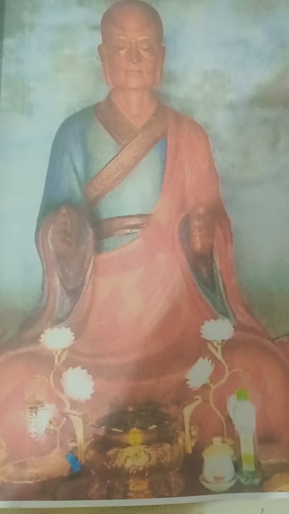
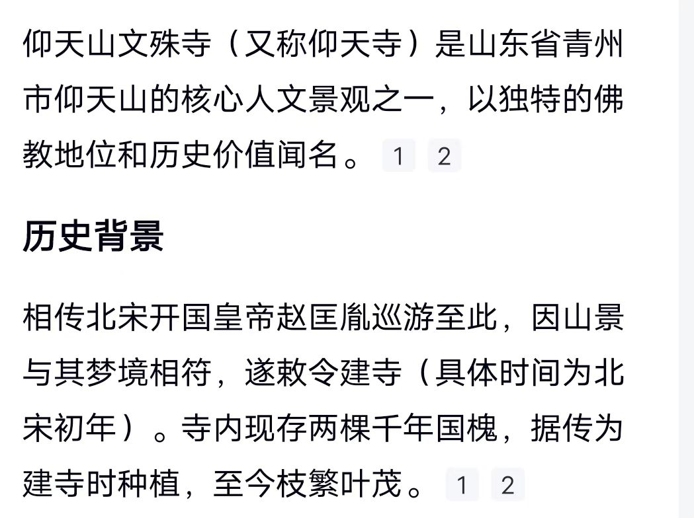
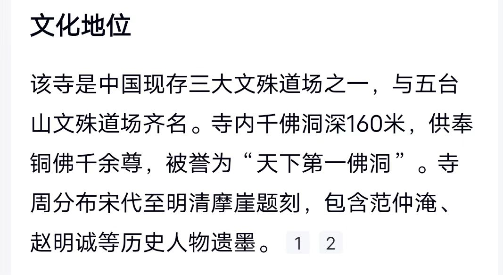

解封印有什么感觉？

没感觉，只是解除后清爽，能力迅速修

老师，请教一下，只靠拉手可以解除封印吗？我特喜欢拉手，因为简

拉手进入境界，能修到很高

@紫鸢真人 老师，拉手要是气太多怎么办？手撑的很大要抱不住了。我帮别人问

说明体内能量很强

让能量柱进入体内，手会自动恢复原来状态，继续

再强了，再用念力融入体内，体内亮度增

反观体内

还有人拉手这么好

我八九岁的时候就是这

两手排斥排斥，一直到两臂都往后了，还排斥

实际上从小就拉手获得能量

达摩祖师拉手

实际上从小就拉手获得能量

二十多岁的时候，去家西边十一公里，仰天山文殊

见到这尊

问了周边的人都说是山神像

门口写着是祖师殿，也没人知道是谁

后来，去北京恭亲王府，和珅府，家里供着一模一样一

写着达摩祖师

才知道仰天山文殊院，是达摩祖

也是奇怪，本来就觉得有渊源

进殿身上会发

试着把手伸到达摩祖师两手间，更加温热

难道小时候，看到墙外那白衣老者是达摩祖师

以前，万佛洞是石

文哥的时候，全砸

九几年，我们那里一个居士，捐款八百万，全换成铜

