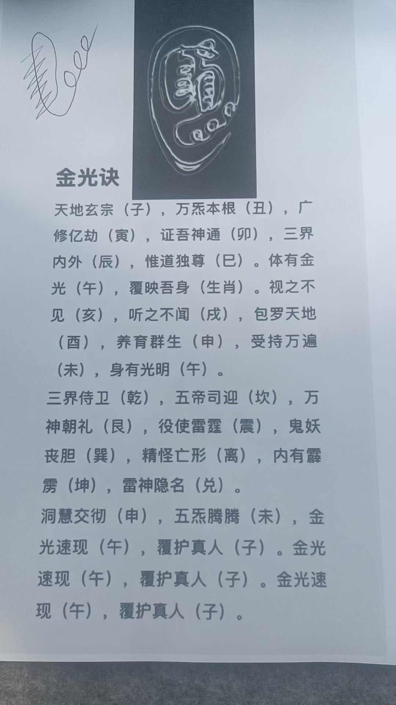
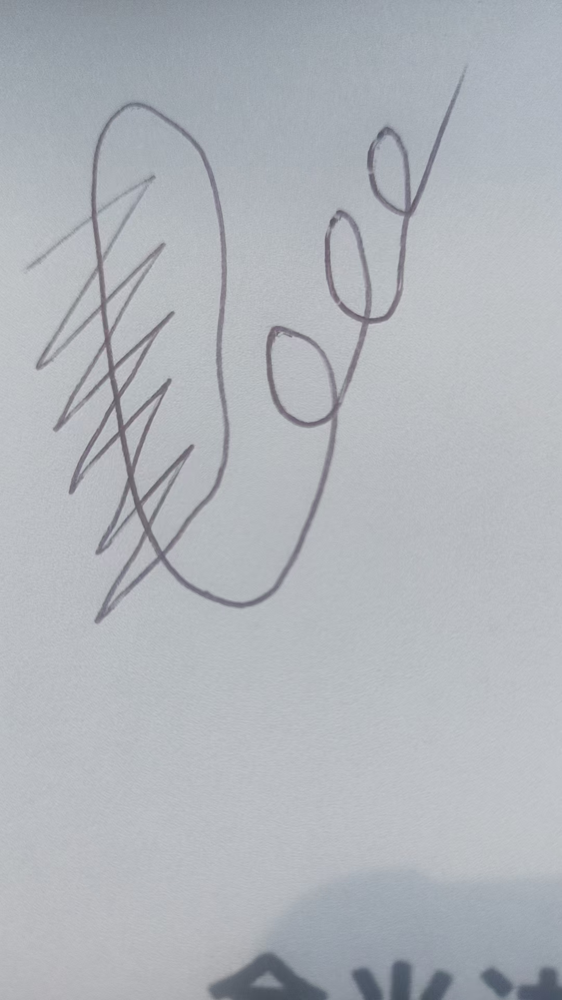
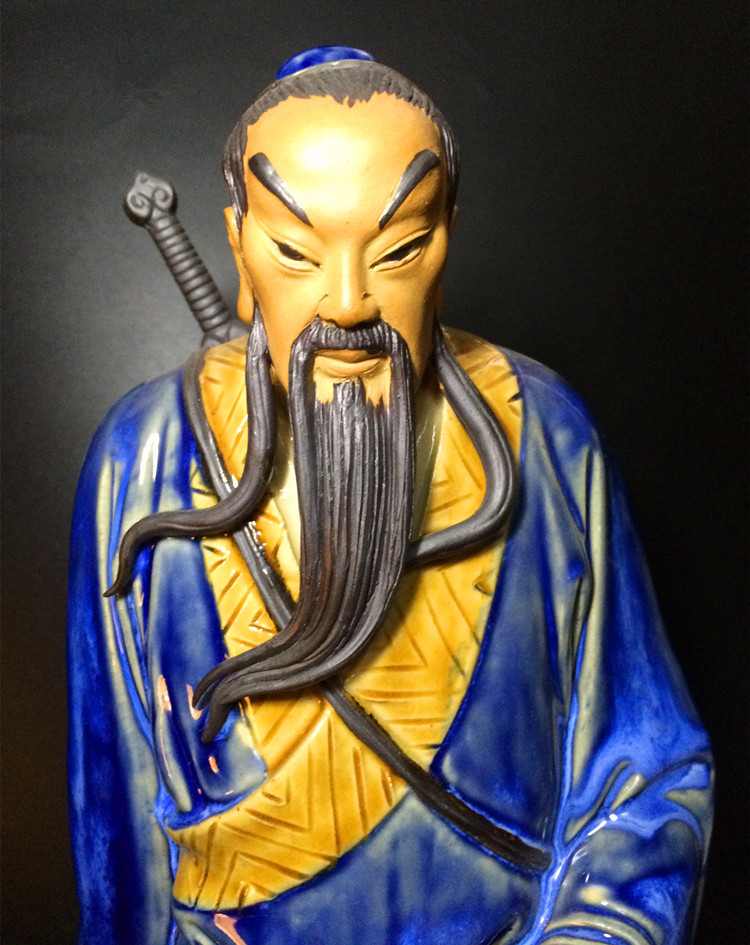
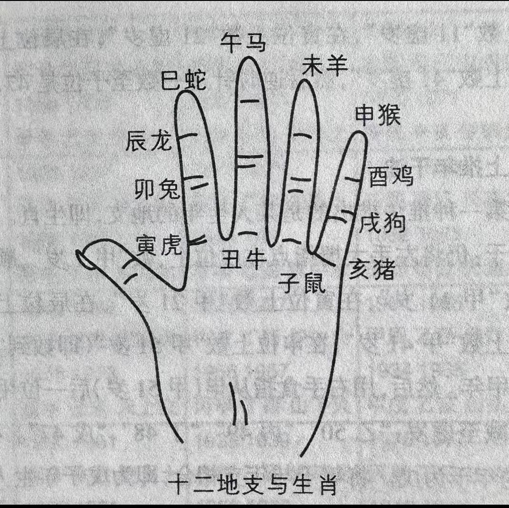
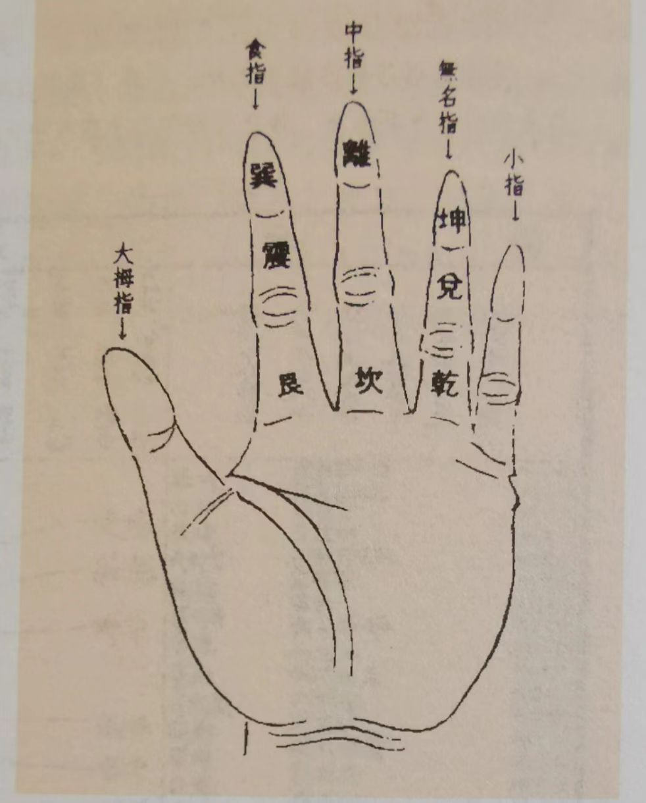
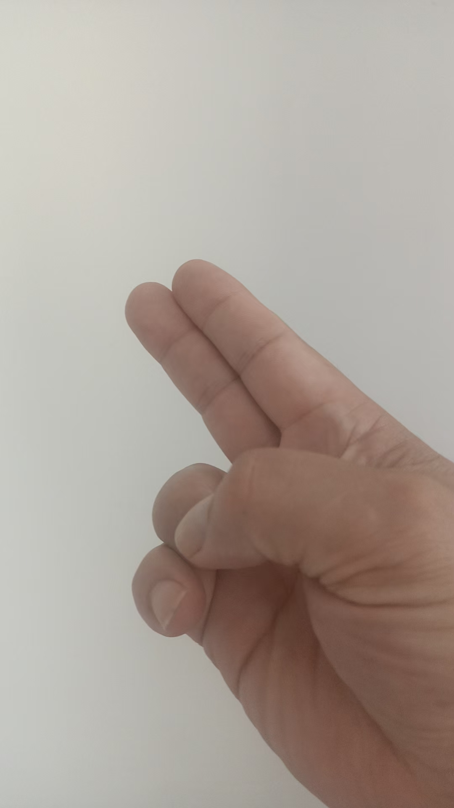
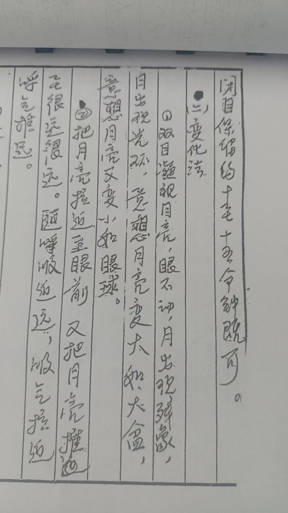
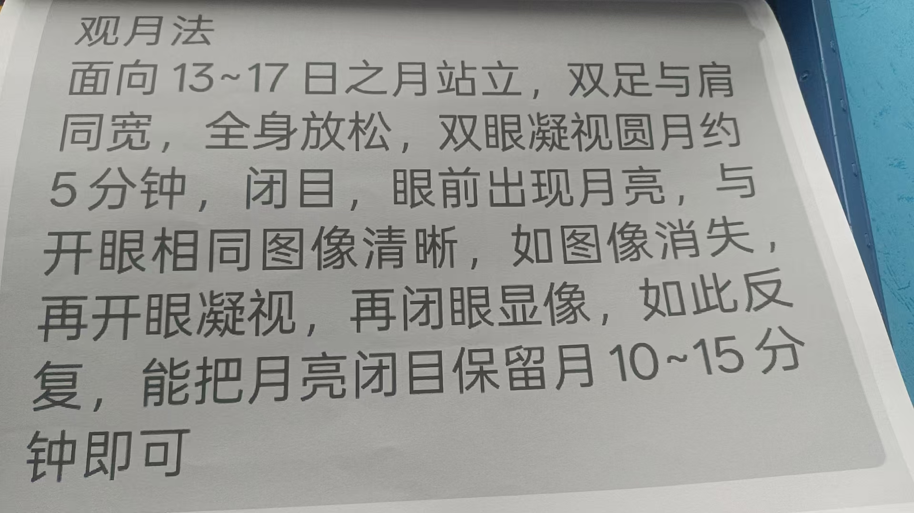
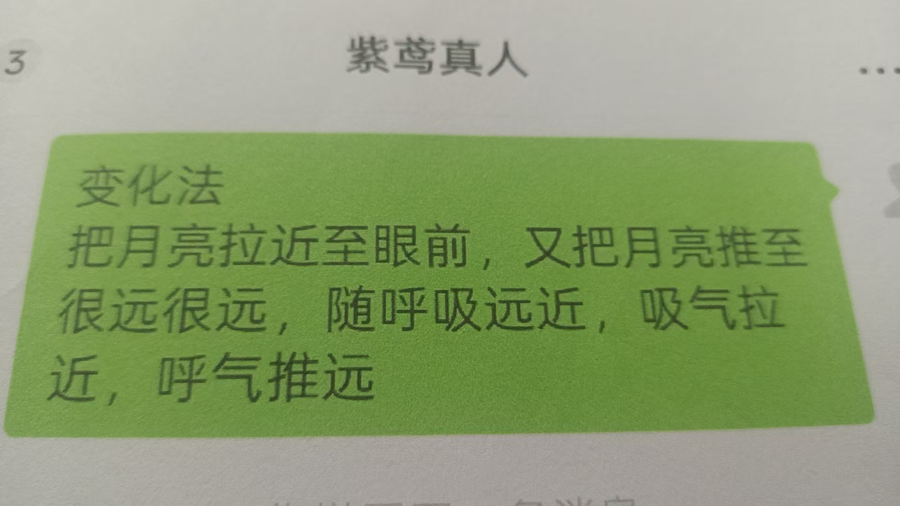
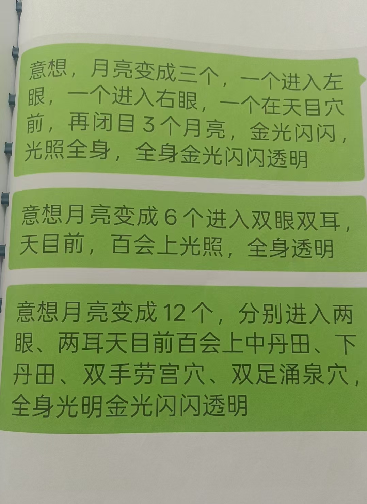

吕祖修炼方法里，提到道家的金光咒

观想自己金光照耀，内外通

这个是金光符
剑指画在黄表纸上，焚化，喝符

金光咒的目的，也是把自己变亮，亮了负场进不来是目
金光速现，覆护真
就是金光到自己身上来，保护自己。这是心法

可以一小块黄表纸，隔空画符，焚化，喝符水
或者直接画在符水里，不过这个符水是温开水。手上有能量，就再加念力，想着剑指在水里写的金光符金光闪闪
是的，有能量为主
没能量念咒也没用，符也没用
给别人化解，就把金光符打到这人身上
或者我让人喝符水，把符打到水里
符水，跟紫薇讳一样，三山印拿着水碗，念咒，写完，让人喝
一个是不喝水，直接把符写到，左手上，再隔空把符打到人身上
打出去，符越来越大，到人身上
另一个，直接剑指把符画到空中，隔几米推到人身上
这样就可以给别人消灾化煞
治疗肿瘤的方法，可以拉出来，也可以用这种方法打出去
各种疾病都是

真人老師是要先開劍指然後金光訣還是，先金光訣再開劍指畫金光符
肯定是先开剑指
妙诀在于心剑合一
这句理解
金光咒的符，你刻在心里，就记住了
一根竖，绕上来，六条横，尾巴上扬三个圈
法术主要是心
要看到自己的慧剑
意念跟慧剑要合一
很多人看不到自己的慧剑，那就修不下去
我看了一眼，看不到慧剑的就是身体有灰，阻挡了心眼
继续提升能量，开心眼

拔剑要结合观
剑在左腰
拔出剑，往前一指，开
还有，要能求得吕祖宝
那就在右肩上
雌雄宝剑
两把
右肩上拔剑，一剑使用，一剑随
如果是开车，剑在车前开
没有灰黑就没有小鬼，车就不会出事，安全很

法身背剑吗？
肉身
各种化身都在肉体上重
平时如果遇到小人
就用剑气，把灰黑气化掉就行了
再一个，慧剑妙用，把剑插入地
剑像金箍棒一样，越来越长
如果地下有泉，剑柄会有流水声
有石，就有撞击声
另外有石油，金矿，银矿，铁矿，都会传达不同的声音，或者信
只有用心体会
这就是吕祖仙法里的慧剑妙

大人以后就远程查病测病治病
各有所长，济世度人
一部分就带超能力孩子
小孩，学习好的继续稳定学习，开发部分超能力，学习一般的，重点开发超能力
走不了寻常路就不走寻常路

十二生肖掐在手上
后天八卦图，掐在手上

自己属什么，就掐在那
比如属猪，就掐在亥上，属狗就掐在戌上，属羊才掐在未上

把这两个图，先掐在手

这就是掌诀

基础知识

上面放着一层白亮光
画在黄表纸上就行
不用朱砂不用

道家看日出，佛家看日
吕祖是看圆月

咱们好多人，想自己身体，不明
不明亮就限制了福分，
超能力也出不
我再把吕祖这个点亮自己的方法，整理一下，发上
别的，因为有约定，绝对不能公开示人，只能咽到肚子里
谁有缘分，拜到吕祖一脉门下，去学去吧

变化成，观日出，观日落，都行
目的是观想，把自己点
到最后看自己，真的是光亮，透明
人家法门的传承人，不允许外传

观月

3~17日月亮站立。双足与肩同宽，全身放松
双眼凝视圆月。约5分钟。闭目。眼前出现月亮。与开眼相同，图像清晰
如图像消失，再开眼凝视，再闭目显像，如此反复
能把月亮闭目保留
0~15分钟即可
双目凝视月亮，眼睛不动。月亮出现残
月亮出现光环。意想，月亮变大。如大盆。意想，月亮又变小如眼球
把月亮拉近至眼前，又把月亮推至很远很远。随呼吸远近吸气拉近，呼气推
一想月亮变成三个。一个进入左眼，一个进入右眼。一个在天目穴前
再闭目
个月亮，金光闪闪，光照全身，全身金光闪闪透明
意想月亮变成6个。进入双眼。双耳。天目前百会上。光照全身透明
意想月亮变成12个。除以上6个以外，进入中丹田。下丹田。双手劳宫穴。双足涌泉穴。全身光明，金光闪闪，透明
意想，吕祖就在月亮中传我法术功夫，给我能
修炼时必须专心，意念高度集中，做到心静神安，忘我之境
修炼必须每天坚持，循序渐进，不可急于求成
修炼时间不可过长，半小时左右为宜
要保证多睡多休息
必须加倍修炼，静坐内功，回光返照，静养内视，补充能
修炼时眼前出现幻影，不要管它。不久就会消
这方法确实妙
可以融汇贯
看早上的太阳，下午的太阳，十五前后的月亮
都可

举一反三
早上太阳，傍晚太阳，圆月，蜡烛，灯泡，都

九转是老君
五行是观音菩萨的
这是吕祖
都是民间秘传，真传绝

后记有传承，关月清，传给朝鲜金刚
最后传给郑志明
说，长期隐居长白山脉
年近八十，面如四

所到之处，必先提前拜当地土地山
要养成习
不然很容易被拦住
在家里神坛或者厨房里

