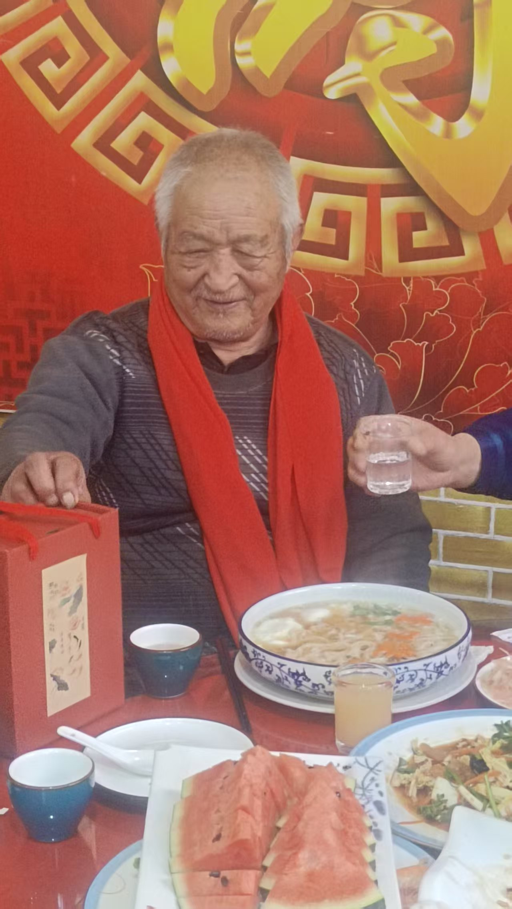


贺父亲九十大
[呲牙][呲牙]
不像九十
[强][强][强]不像
[强][强][强]
[蛋糕][玫瑰][玫瑰][玫瑰][福][福][福][庆祝][庆祝][庆祝]
八十八岁的时候，很虚，走路就
现在不喘
生日快乐🎂🎉🎊
一生抽

爷爷万福[抱拳][抱拳][抱拳]
旱烟，就是农村那种烟叶，
中医里旱烟好像对身体
一桌的亲戚，六七十岁，浑身是病，所以我说健康长寿跟抽烟喝酒没关
[呲牙][呲牙]
非典，新冠老两个都没事
常年不感
我都说感冒菌都给熏跑
据说非典的时候抽烟的和带眼镜的得的少[呲牙]
好像记得当初有这样的一个数
所以，我们喝酒，最少一杯半
一
2
一杯半才达
75度以
[呲牙][呲牙]
[呲牙][呲牙]尤其是新冠，75度酒精能杀死病
劝酒良方
一
0
加半
5