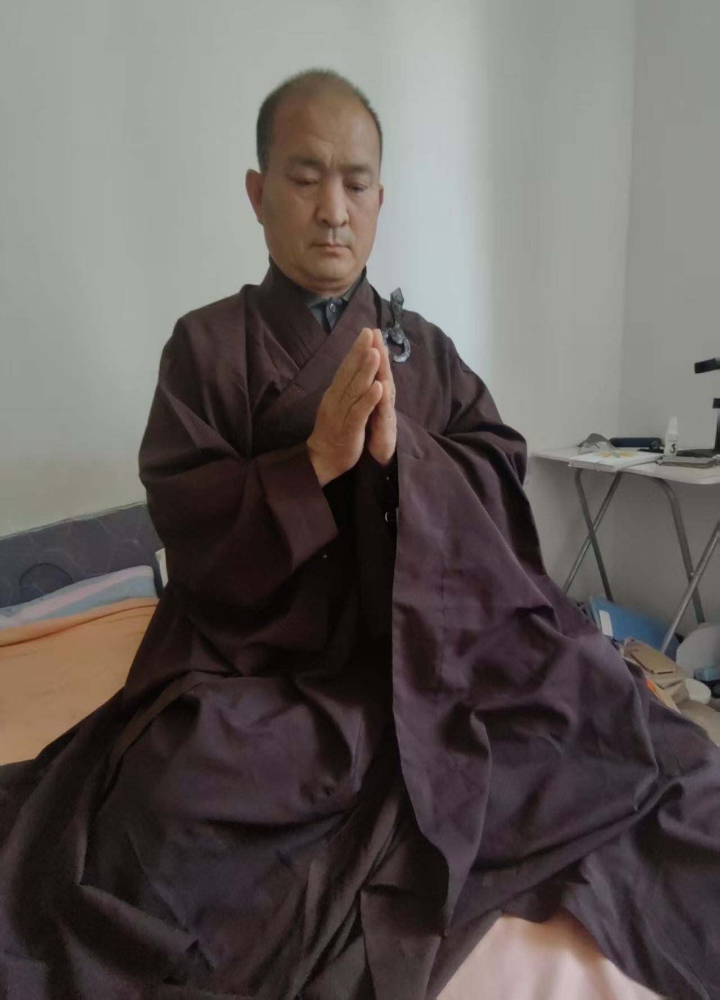
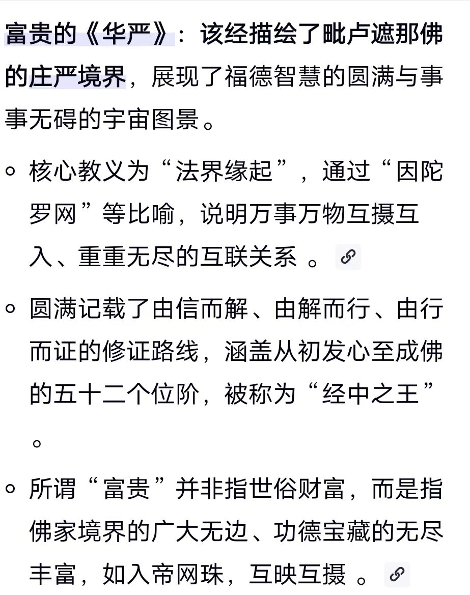

师父说得对人生苦短修行我还来得及
咱们的方法节省了时间
观想师傅，如在眼前，放大光明
我看你身体内外亮了很
纯亮了就开眼开悟了
感恩师父[合十][合十][合十]
感恩师父[合十][合十][合十]
开眼开悟之后，第一知命
然后改命
改变自己的生命轨
@紫鸢真人
 [强][强][强]挺正
能坚持一年吗？[呲牙][呲牙]
师父我感觉自己没有改变手上自己看还没
坚持一生啊
@连文 [呲牙][呲牙]
@一惠 你放出来，感觉最强的时候去
我要改命我坚
@紫鸢真人 太棒了为师父点[强][强][强]
近来练五行九转头有点紧好象有什么东西要出来又出不？
师父好的[合十][合十][合十]
心在内，其余的不用管
身体自动变化
谢谢师父[合十][合十][合十]
出现任何功能，都会时至神
@紫鸢真人 师父，九转第六步的时候，舌低上颚的时候，舌头会麻，啥原因[捂脸]
酸麻热胀刺，轻重浮沉
各种感觉之一，很正常
之前没有，最近发现的
好的
@一惠 有个法器叫时间
身体左边就是你的过去
右边就是未来
你看你的右边，亮的远
是不是亮的不远就是灰
闭眼去看
观想自身放出能量
去延长右边的白亮
使劲放，越远越好
往后，画一个长格子
一格十
看看过几个十年格，最后一个灰的白的全没了
这一格就是肉身本命终
先会看自己，再看别人
师父每晚练时
然后，把十年格，分成十格
看每一格的颜色
大致是，白灰黄粉红颜
白的格就是这一年运势好，财
灰的就是不顺利，不舒
黄的，疾病手术伤
粉红是喜事喜
白的年头，利于投资创
灰的年头趋吉避凶
然后，把一年格分成十二小格
看颜色，分辨月份吉凶
每月分成三十
看颜色，就知道每天吉
每天分成两格，就是白天黑
白天黑夜各分六格，就是六时辰
详细去修这个
前提是心相光明，其他拉手不够的，继续
先知道这个修
好的感恩师父慈悲教诲弟子紧记[合十][合十][合十]

眼功继续提升，能看到一天里哪个时辰，举例，比如说这时辰黄色
就要注意，黄色是破财
但是，为什么破
疾病，伤灾，磕磕碰碰，还是失
眼功高了，就能看到图片，片段，视
就一清二楚了
就可以告诉别人，某天某时防失
原来古人看相是这样看的，而不是公式推
推断只有百分之七
这样看，百分

@欢欢 你先看，怎么能心相光
你这一步还没做到，所以问
超越冥想
不过你身上亮度还
继续下一
观想师傅如在眼前，放大光明，纯一不杂
嗯，收到，谢谢师父
这个师傅，可以是佛祖，可以是太上老君 可以是观世音，也可以是真

孩子们看到我紫金
是对
我在修紫金身
真实不虚

法相庄严
有个好处，我喝了酒这样说，不算泄露天

佛音绕梁
每天四点自然醒，
脑海里就唱佛
洗漱，穿
背楞严咒

金刚经破诸相
楞严经破诸法
成佛的法
富贵的华

憨山大师，就是现在坐在慧能大师左边的肉身菩萨
右边是丹田大
跟生前一模一样，这才是绝
肉身不腐，人元金丹具
时间尺延伸修
身上这一格是今生
往左一格，是上一世，两格是上二世，依次类推，
佛经里说，修七世父母
实际上是个精密的
这一世，的父母，上七
上一世的父母，不是现在的父母，他们又有自己的上七
前一世的父母，又不一样，又要修他们的七世
要分清晰
自己的前七世，要看清
还要看，自己的后七世
后七世的父母的七
七世只是修法，要看无数世
前看到来处，后看到归
前看到原始之初，混沌世界
后看到未来之中，一片虚
修过去未来，开慧眼通里的追眼通，预眼
修法，在地藏经里
遥视千里，慧眼通里有个遥视，清晰的看到千里之外
现在的孩子千里意念拍照，录像，隔空传输到手机
遥视眼，修法在佛说阿弥陀经里

菩萨十地
五十二个成佛阶次
都说的一清二
所以说，佛道儒，广才儒释道
用心学习研究
别一句，我不信佛，我不信道，把自己排斥在成就之外
七田真，还是从密宗，净土宗里参悟出孩子过目不忘，超级记忆方
我说的都是实战经
实修实证
应该是没有人讲过这么细节的修炼方法吧

要有刚决坚定之心修行修炼
返还回去
不在人间里，浑浑噩噩，坑坑坎
我在寺里，加入了念力，领唱思乡佛号
把小和尚，跟部分男女受戒的都唱哭
确实看到，不少人前世是大罗汉
俗世长相就不一
悟正师父[合十][合十][合十][强][强][强]
悟正师父原思乡佛号听着就有回家的喜悦[合十][合十][合十]
悟正师父我很想听您加入念力的思乡佛号[合十][合十][合十]
[强][强][强]
[强][强][强]
师父我一听思乡佛号，小腹就非常清爽，是共振到那个场域了吗？还是说其他呢

